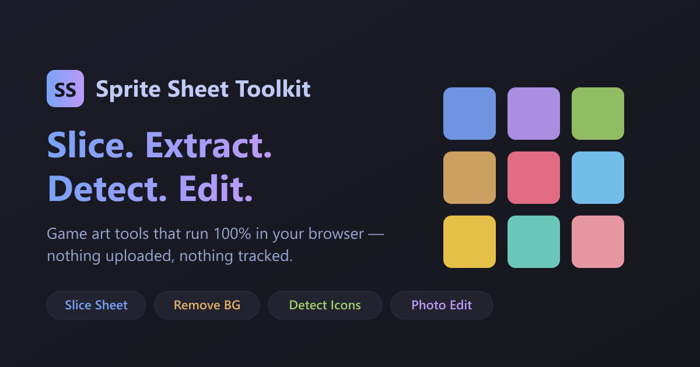

# 🎮 Sprite Sheet Toolkit

A free, **100% in-browser** toolkit for game artists and indie developers.
Slice sprite sheets, auto-remove backgrounds, detect UI icons, and edit
images with a built-in Photoshop-style editor — all without uploading a
single file.

**▶ Live: https://monierhossam.github.io/tools/sprite-sheet-toolkit/**

---

## 🔒 Private by design

Everything runs locally in your browser using the Canvas API. **Your images
are never uploaded, and nothing is tracked.** Works offline once loaded.

## ✨ What's inside — four tools in one

| Tab | What it does |
|-----|--------------|
| **Slice Sheet** | Slice a sprite sheet by grid, auto-detection, or manual lines. Name, categorize into folders, and export an organized ZIP. |
| **Extract Background** | Remove UI elements from a screen and keep the clean background plate (edge-mask + brush + inpaint). |
| **Detect Icons** | Automatically find UI elements in a screen and export each as a transparent PNG, plus a `layout.json` with positions (ready for Unity). |
| **Photo Edit** | A custom Photoshop-style editor: 20 tools — auto-background-remove, magic eraser, crop, brush, bucket, clone stamp, heal, smudge/blur/sharpen/dodge/burn, gradient, text — with filters, transforms, a layers-like **Versions** panel, undo/redo, and zoom. |

## ⌨️ Photo Edit shortcuts

| Shortcut | Action |
|----------|--------|
| `Ctrl`+`Z` / `Ctrl`+`Shift`+`Z` | Undo / Redo |
| `Ctrl`+`S` / `Ctrl`+`Shift`+`S` | Save (override) / Save As |
| `Ctrl`+`+` / `Ctrl`+`-` · Wheel | Zoom in / out · zoom at cursor |
| `Ctrl`+`0` / `Ctrl`+`1` | Fit / 100% |
| `Enter` / `Esc` | Apply / cancel crop |

## 🌐 Browser support

Works in all modern browsers. **Chrome & Edge** additionally unlock folder
browsing and save-in-place (via the File System Access API). Firefox and
Safari can open, edit, and download. Desktop only — touch editing isn't
supported yet.

## 🚀 Use it

Just open the live link — no install, no account, no build step. Or download
`index.html` and open it locally; it's a single self-contained file.

## 🛠️ Tech

A single HTML file: vanilla JavaScript + the Canvas API. The only dependency,
[JSZip](https://stuk.github.io/jszip/) (for ZIP export), is vendored inline so
the tool works fully offline.

## ❤️ Support

If this saves you time, consider [sponsoring](https://github.com/sponsors/MonierHossam).

## 📄 License

[MIT](LICENSE) © 2026 Monier Hossam · bundles JSZip (MIT).
